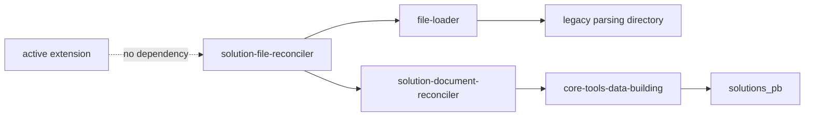

# Legacy Reconciliation Removal Plan

## Goal

Remove the unused legacy YAML parsing, reconciliation, and Core Tools protobuf
conversion stack while preserving the active YAML editing, create-solution, pack,
and binary-file workflows.

The legacy path is isolated from the active extension runtime:



## 1. Decouple the Active Type Imports

Before deleting the legacy parsing directory, remove its two remaining active
type consumers.

### Group editing types

- In `src/solutions/edit/manage-group-items.ts`, replace `FileData` and
  `GroupData` with one locally owned exported data shape containing:
  - `name`
  - `forContext`
  - `notForContext`
- Simplify `FileOrGroup` to use that shape for both files and groups. The active
  editing code does not use `GroupData.files` or `GroupData.groups`.
- Update `src/views/solution-outline/commands/add-to-group-command.ts` to import
  the new type from `manage-group-items`.
- Move `fileDataFactory` from
  `src/solutions/parsing/common-file-parsing.factories.ts` into
  `src/solutions/edit/manage-group-items.test.ts` as a local test helper.

### Active serializers

Trim `src/solutions/solution-serialisers.ts` to its two active exports:

- `serialiseDeviceWithoutVendor`
- `serialiseBoardIdWithoutVendor`

Replace their generated `solutions_pb` parameter types with small structural
types. Reduce `src/solutions/solution-serialisers.test.ts` to the retained
behavior.

### Validation checkpoint

Run the focused tests for the active behavior before deleting legacy code:

```bash
npm test -- --runTestsByPath \
  src/solutions/edit/manage-group-items.test.ts \
  src/views/solution-outline/commands/add-to-group-command.test.ts \
  src/views/create-solutions/view/create-solution-view-model.test.ts \
  src/solutions/solution-serialisers.test.ts
```

## 2. Delete the Reconciliation Layer

Delete the complete `src/solutions/reconciliation` directory:

- `solution-file-reconciler.ts` and its test
- `solution-document-reconciler.ts` and its test
- `yaml-reconciler.ts` and its test

`reconcileSolutionFiles` has no production caller.

## 3. Delete the Legacy Parser and Model Layer

After step 1 removes the active type imports, delete the complete
`src/solutions/parsing` directory.

This removes:

- YAML parser combinators, including `yaml-file-parsing.ts`
- Solution, project, layer, default, build-pack, and cbuild-index parsers
- `file-loader.ts`
- Legacy solution model types
- Parsing factories and utilities
- All neighboring parser tests

Delete this directory as a unit to avoid retaining disconnected parser helpers
or model types.

## 4. Delete Stranded Conversion Code

Delete the code whose only purpose was converting the legacy parsed model into
protobuf data:

- `src/core-tools/core-tools-data-building.ts` and its test
- `src/core-tools/destringify-processor-data.ts` and its test
- `src/core-tools/core-tools-service.factories.ts`
- `src/solutions/deserialising/solution-deserialisers.ts` and its test

Keep `src/solutions/deserialising/solution-data.ts`; active pack handling still
imports its domain types.

## 5. Remove the Obsolete Generated Client

Once the serializer coupling is gone, verify there are no source references to
`solutions_pb`, then delete:

- `src/core-tools/client/solutions_pb.js`
- `src/core-tools/client/solutions_pb.d.ts`

Keep `packs_pb.js` and `packs_pb.d.ts`; active pack, board, device, and utility
code still uses them.

The `download:rpc-interface` script targets the JSON-RPC interface directory
and does not regenerate `solutions_pb`.

## 6. Preserve Active Workflows and Dependencies

The following code remains outside the removal boundary:

- `src/solutions/deserialising/solution-data.ts`
- `src/solutions/common-yaml/test-helpers.ts`
- `src/core-tools/client/packs_pb.js`
- `src/core-tools/client/packs_pb.d.ts`
- Active YAML editing under `src/solutions/edit`
- Active `CSolution` and `CTreeItemYamlFile` based loading
- `src/solutions/binary-file-locator.ts`, which reads `CbuildRunYamlFile`

No package dependency should be removed as part of this cleanup:

- `yaml` remains used by active YAML editing and CMSIS Common code.
- `google-protobuf` remains required by `packs_pb`.
- `@faker-js/faker` remains used by other tests.

## 7. Final Verification

Search for residual source references:

```bash
rg "solutions/parsing|solutions/reconciliation|core-tools-data-building|solution-deserialisers|destringify-processor-data|solutions_pb" src
```

The search should return no references to deleted code. Then run:

```bash
npm run compile
npm run lint
npm run build
npm test
```

The first decoupling checkpoint should be validated independently. After that,
deleting the isolated legacy files should be mechanical and straightforward to
review.